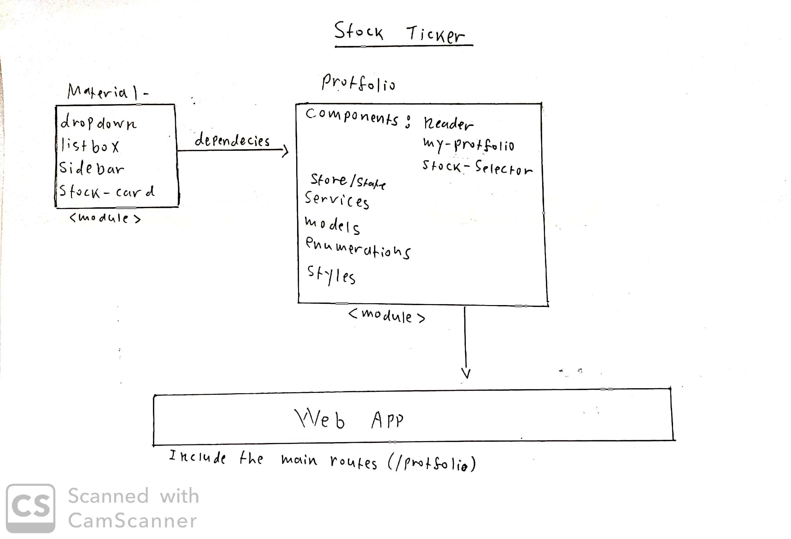

# Stellare Stock

## Diagram


## Struct
* [Material](#Material)
* [Protfolio](#Protfolio)
  * [Components](#Components)
  * [Store](#Store)
  * [Services](#Services)
  * [Models](#Models)
  * [Enumerations](#Enumerations)
  * [Styles](#Styles)
* [Web-App](#Web-pp)


## Material
Material is a seperate module that based on Primeng for the UI components, gridsystem and flex of bootstrap.

Material include 4 components with a "st" prefix


| Components        | Selector | Inputs           | Output  |
| ------------- |:-------------:| -----:| -----:|
| dropdown     | st-dropdown | SelectItem[]   |selectEvent
| listbox      | st-listbox  |   SelectItem[] |selectEvent
| sidebar | st-sidebar     |    display | heideEvent
| stock-card | st-stock-card  | Stock | removeEvent


## Protfolio
Seperated module that includes the views of components
| Components        | Selector | Inputs           | Output  |
| ------------- |:-------------:| -----:| -----:|
| header     | st-header | title   |sliderEvent
| my-protfolio      | st-my-protfolio  |   title |label
| stock-selector | st-sidebar  | SelectItem | heideEvent
| stock-card | st-stock-card  | Stock | 

## Store
Todo

## Models
A part of store 
```js
export interface Stock {
    stock?: string;
    price?: string;
    volume?: string;
    lastUpdate?: number;
}
```
## Styles
* main.scss
* _fonts.scss
* _varibales.scss